# Iron Fitness

- Iron Fitness Gym is an all encompasing website built to simplify the gym goers experience. 
- It features a complete membership subscription service and and class booking. 
- All done in a sleek, modern and user friendly style

## Design

### Wireframes

#### Desktop

Home

Subscription

Plan Details

Checkout

Checkout Page 2

Successful purchase

Classes

Booking Successful

Contact

Profile

Profile Edit

#### Mobile

Home

Subscription

Plan Details

Checkout

Checkout Page 2

Successful purchase

Classes

Booking Successful

Contact

Profile

Profile Edit

#### Side note
- I didnt make any wireframes for the allauth pages since i didnt really change the layout of them

### Styling

#### Color Pallette
- I wanted a clean looking website so the color pallette i chose was just black and white

#### Font 
- I wanted the font to be modern and sleek so i decided to go with Roboto.

## Site content

### My pages

#### The landing page

 - The landing page gives the user a stylish welcome to the page 
 - It features a short video to grab the attention of the users

  

Click to expand

  

  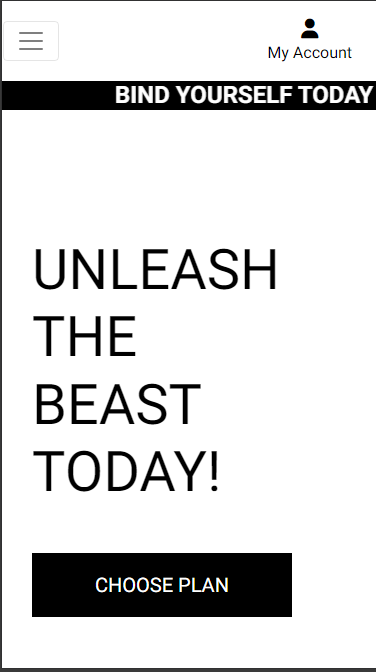
  

#### The subscription page

 - The subscription page houses the different subscription plans available on the site

  

Click to expand

  

  
  

 #### The plan details page

 - This page displays infromation about the plan the user selected
 - It also has a subscribe now button which is how you access the checkout page

  

Click to expand

  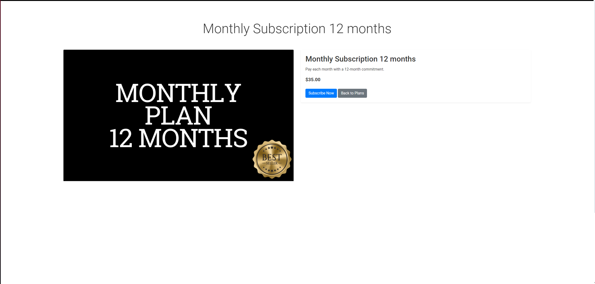

  
  

 
 #### The checkout page

  - This is where the user can subscribe to any given plan
  - It features clean form and a stripe payment system which makes it very easy to use for the user

  

Click to expand

  

  
  

#### The Contact page

 - This page displays the necisary infortmation about the gym, like contact number and mail. It also has a google maps link that displays "the location" of the gym. 
 - It also features an image slider that 

  
  
  
  

### Allauth pages

 - These are the pages that are supplied with allauth, although i have customized them.

  ### Profile page

  

  ### Profile edit page

   

  ### Login 

  

  ### Register 

  

  ### Forgot password

  

## Features 

### Existing Features

#### Base template
  - This project features a base template which is used to clean up the rest of the code by simply extending it in every other template

#### Navigation Bar
  - Accessible on all pages, the fully responsive navigation bar includes links to the Home page, Classes page, Subscription page, Contact page, and the pages tied to the user profile

Click to expand

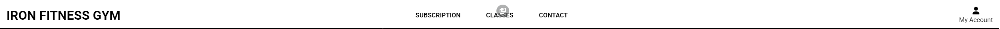

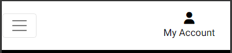

#### Stripe payment system

Click to expand

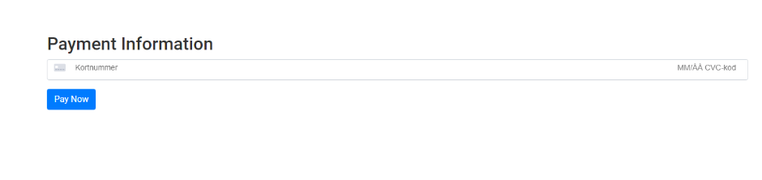

#### Managing subscriptions

Click to expand

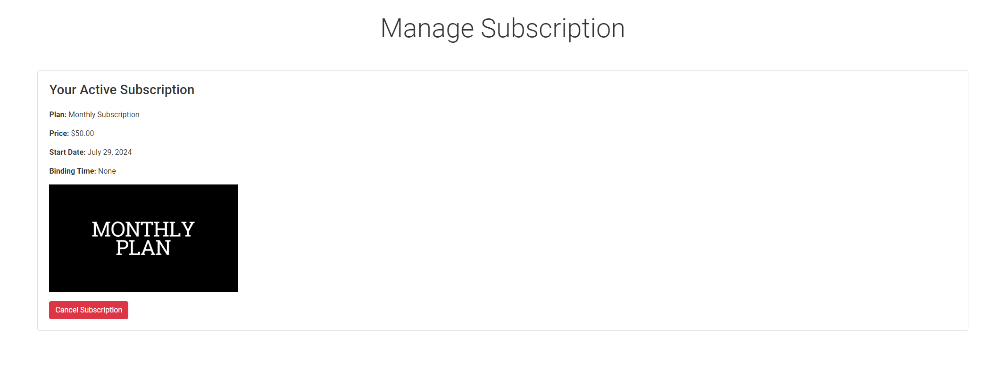

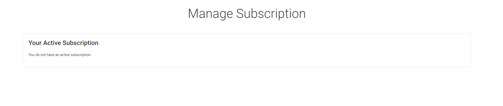

#### Binding time

Click to expand

#### Dynamic display of active subscriptions

Click to expand

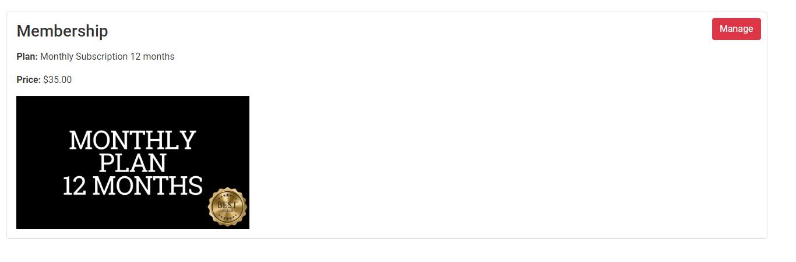

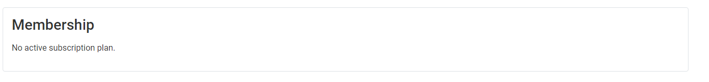

#### Class booking system 

Click to expand

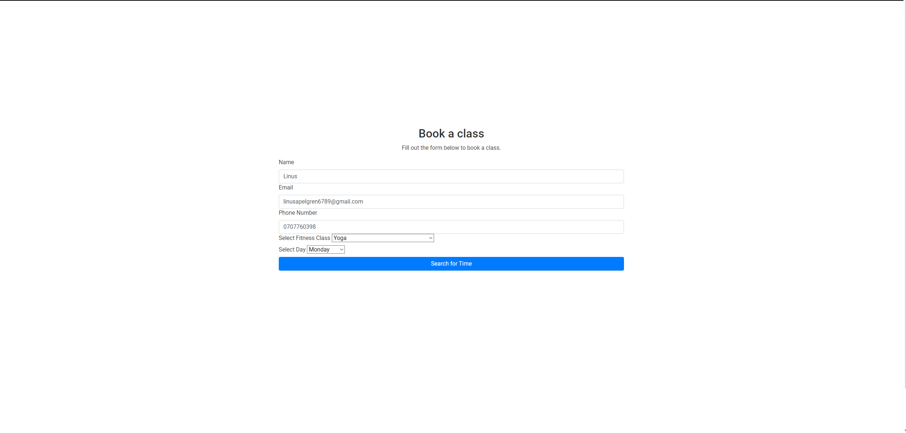

#### Class scheduling

Click to expand

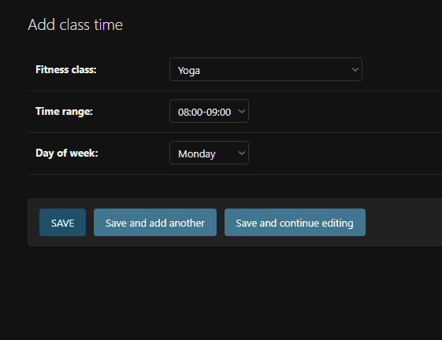

#### Google maps

Click to expand

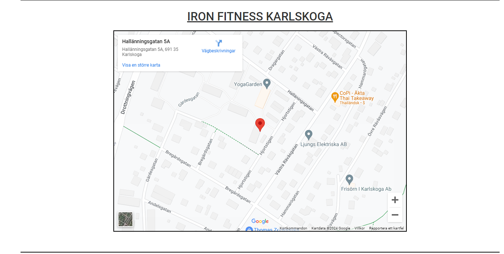

#### Allauth features
- The site uses allauth which handles user accounts
- This allows the users to register accounts login, reseting passwords and managing their accounts

#### MailJet 
- MailJet is used to send emails to the user

### Features Left to Implement

- An online shop for supplements, clothing and gym equipment

## Technologies Used

### Packages

The following packages were installed throughout the development. 

| Package Name| Package Description |
| ----------- | ----------- |
| [Django-allAuth](https://docs.allauth.org/en/latest/)
| [Whitenoise](https://pypi.org/project/whitenoise/)   
| [Pillow](https://pypi.org/project/pillow/) 
| [Stripe](https://dashboard.stripe.com/test/developers) 
| [Black](https://pypi.org/project/black/) 

### Tools and Programs Used

- [GitPod](https://gitpod.io/workspaces) was used as the main IDE for the project. 
- [Git](https://git-scm.com/) was used for version control. 
- [GitHub](https://github.com/) for hosting my repository
- [Heroku](https://id.heroku.com/login) was used for deployment.
- [Favicon.io](https://favicon.io/) was used to create the favicon for Perfect Fit.
- [AmIResponsive](https://ui.dev/amiresponsive) for creating the README header image. 
- [FontAwesome](https://fontawesome.com/) for providing icons used throughout the site.  
- [Balsamiq](https://balsamiq.com/) for creating the wireframes. 
- [Code Institute Pep8 Linter](https://pep8ci.herokuapp.com/#) was used for reviewing all .py files during code validation tests. 
- [Google cloud](https://console.cloud.google.com/welcome/new?project=plated-reducer-430217-s6) was used for implementing google maps
- [Canva](https://www.canva.com) was used for creating assets used in the project

## Testing 

In this section, you need to convince the assessor that you have conducted enough testing to legitimately believe that the site works well. Essentially, in this part you will want to go over all of your project’s features and ensure that they all work as intended, with the project providing an easy and straightforward way for the users to achieve their goals.

In addition, you should mention in this section how your project looks and works on different browsers and screen sizes.

You should also mention in this section any interesting bugs or problems you discovered during your testing, even if you haven't addressed them yet.

If this section grows too long, you may want to split it off into a separate file and link to it from here.

### Validator Testing 

- HTML
  - No errors were returned when passing through the official [W3C validator](https://validator.w3.org/nu/?doc=https%3A%2F%2Fcode-institute-org.github.io%2Flove-running-2.0%2Findex.html)
- CSS
  - No errors were found when passing through the official [(Jigsaw) validator](https://jigsaw.w3.org/css-validator/validator?uri=https%3A%2F%2Fvalidator.w3.org%2Fnu%2F%3Fdoc%3Dhttps%253A%252F%252Fcode-institute-org.github.io%252Flove-running-2.0%252Findex.html&profile=css3svg&usermedium=all&warning=1&vextwarning=&lang=en#css)
- JS
 - No errors were found when passing through the official [(Jigsaw) validator](https://jigsaw.w3.org/css-validator/validator?uri=https%3A%2F%2Fvalidator.w3.org%2Fnu%2F%3Fdoc%3Dhttps%253A%252F%252Fcode-institute-org.github.io%252Flove-running-2.0%252Findex.html&profile=css3svg&usermedium=all&warning=1&vextwarning=&lang=en#css)
- Python
 - No errors were found when passing through the official [(Jigsaw) validator](https://jigsaw.w3.org/css-validator/validator?uri=https%3A%2F%2Fvalidator.w3.org%2Fnu%2F%3Fdoc%3Dhttps%253A%252F%252Fcode-institute-org.github.io%252Flove-running-2.0%252Findex.html&profile=css3svg&usermedium=all&warning=1&vextwarning=&lang=en#css)

### Lighthouse tool

### Manual testing

### Unfixed Bugs

- When signing up it says internal server error but if you refresh the page it works again

## Deployment

For this project the application was deployed to Heroku using the following steps:

1. I logged into my Heroku account and navigated to the dashboard. 
2. From here I clicked 'New' and created a new app.
3. perfect-fit was chosen as the app name and region set to EU, finally I clicked 'Create app'
4. In the 'Settings' tab and from here I located the section 'Config Vars' and clicked 'Reveal Config Vars'
5. Ensure that within the settings.py file the DEBUG has been set to False
6. From here you can add your environment variables for your Database, Secret Key, CollecStatic, Cloudinary Database, Stripe Public Key, Stripe Private Key and Webhook Secret. 
7. After this has been done navigate to the 'Deploy' tab and under 'Deployment Method' click on 'GitHub'.
8. Locate the repository from GitHub and paste the link here and click 'Connect'.
9. Ensure that the selected branch is 'main branch' before clicking to Deploy. 
10. Once the build is finished there should be a message saying 'Your app was successfully deployed' with a 'View' button.

## Credits 

- [Pexels](https://www.pexels.com/sv-se/) for images used on the site
- The Boutique Ado walkthrough project, which helped with the building of my project
- [Codepen] (https://codepen.io/kevinpowell/pen/BavVLra) for helping me with the scrolling message banner
- [Youtube] (https://www.youtube.com/watch?v=PkADl0HubMY) for helping me with the image slider
