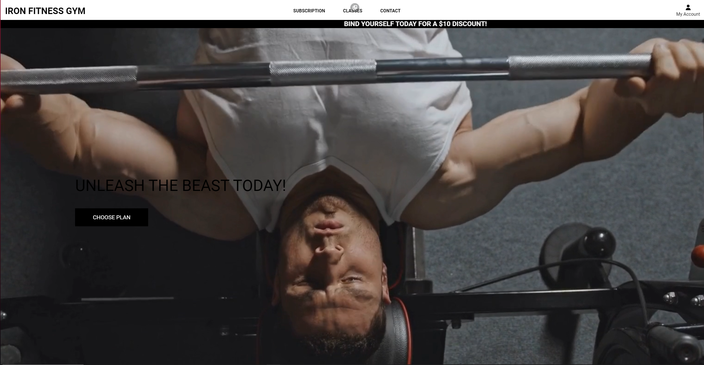
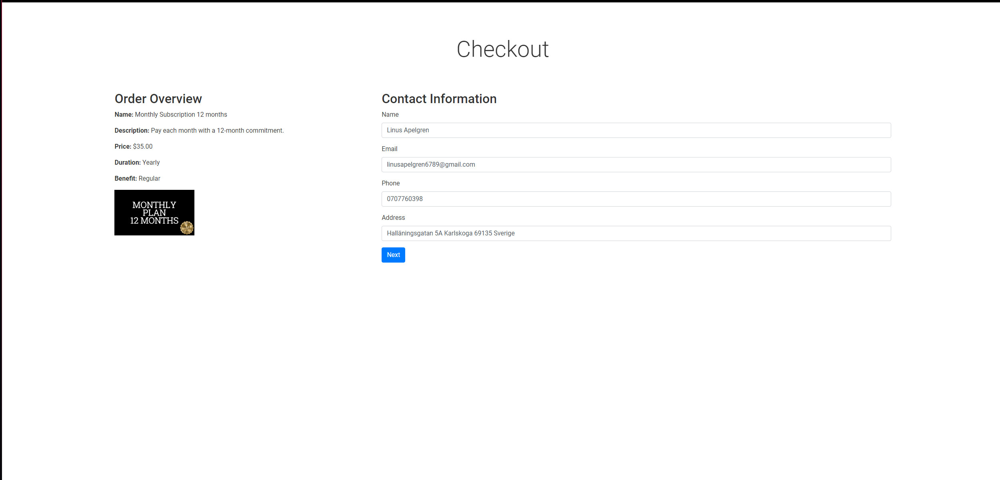

# Iron Fitness

## Overview
- Iron Fitness Gym is an all encompasing website built to simplify the gym goers experience. 
- It features a complete membership subscription service and and class booking. 
- All done in a sleek, modern and user friendly style

Deployed Site - [Iron Fitness](https://ironfitness-9cbf5540effc.herokuapp.com)

## Content
- [User Stories](#user-stories)
- [Design](#design)
    - [Wireframes](#wireframes)
    - [Site Styling](#styling)
- [Marketing](#marketing)
- [Site Content](#site-content)
- [Features](#features)
- [Technologies Used](#technologies-used)
    - [Packages](#packages)
    - [Tools and Programs Used](#tools-and-programs-used)
- [Testing](#testing)
    - [Validator Testing](#validator-testing)
    - [Lighthouse Tool](#lighthouse-tool)
    - [Manual Testing](#manual-testing)
- [Deployment](#deployment)
- [Credits](#credits)

## User Stories

#### EPIC | Viewing and Navigation
- As a Site User, I can intuitively navigate around the site so that I can find content.
- As a Site User, I can view a list of availible subscription plans and select a plan to view
- As a Site User, I can find all the relevant information about the gym
- As a Site User, I can sign up for a newsletter using my email

#### EPIC | User Account and Profile
- As a site user, I can register an account so that I can have a personal account.
- As a site user, I can log in or log out of my account so that I can keep my account secure.
- As a site user, I can see my login status so that I know if I'm logged in or out.
- As a site user, I can save my personal details in my user profile
- As a site user, I can view my current subscription plan
- As a site user, I can recover my password in case I forget it so that I can recover access to my account.

#### EPIC | Subscriping
- As a site user, I can securely enter my payment information so that I can subscribe to my chosen plan quickly
- As a site user, I can cancel my subscription plan easily on my profile page
- As a site user, I can find and select a subscription plan to subscribe to easily

#### EPIC | Booking
- As a site user, I can choose from a multitude of gym classes to attend
- As a site user, I can book a gym class quick and easy
- As a site user, I can see my booked classes on my profile page

#### EPIC | Admin & Store Management
- As a site admin, I can add or remove subsription plans from the admin panel
- As a site admin, I can add or remove scheduled class times from the admin panel
- As a site admin, I can send out bulk emails to all my newsletter subscribers through an easy to use page 

## Design

### Wireframes

#### Desktop

Home

Subscription

Plan Details

Checkout

Checkout Page 2

Successful purchase

Classes

Booking Successful

Contact

Profile

Profile Edit

#### Mobile

Home

Subscription

Plan Details

Checkout

Checkout Page 2

Successful purchase

Classes

Booking Successful

Contact

Profile

Profile Edit

#### Side note
- I didnt make any wireframes for the allauth pages since i didnt really change the layout of them

### Styling

#### Color Pallette
- I wanted a clean looking website so the color pallette i chose was just black and white

#### Font 
- I wanted the font to be modern and sleek so i decided to go with Roboto.

#### Database Schema

 - The ER Diagram was made using (https://dbdiagram.io/)

  

ER Diagram

  
  

## Marketing

#### Business Model 
The chosen business model for this e-commerce site is B2C (Business to Consumer). IronFitnessGym was created with the goal of offering users a seamless, convenient way to sign up for gym memberships and book classes, all online. By using our platform, customers can bypass the traditional hassles of gym reception desks and restrictive opening hours.

Once a user subscribes to a membership, they immediately receive a virtual gym card, enabling them to start their fitness journey without waiting for a physical card to arrive. This instant access ensures a smooth and efficient start to their training, saving valuable time and providing a hassle-free experience.

Our mission is to inspire as many people in Karlskoga as possible to begin their fitness journey. We aim to provide easy access to top-quality training options and build a supportive community where fitness enthusiasts can thrive, all with the convenience of managing everything online.

#### Iron Fitness - Facebook

To enhance the promotion of Iron Fitness on social media, a Facebook page has been established. Success in e-commerce on Facebook is driven by regular updates, active user engagement, feedback polls, and competitions designed to attract both new and returning customers.

## Site content

### My pages

#### The landing page

 - The landing page gives the user a stylish welcome to the page 
 - It features a short video to grab the attention of the users

  

Click to expand

  

  
  

#### The subscription page

 - The subscription page houses the different subscription plans available on the site

  

Click to expand

  

  
  

 #### The plan details page

 - This page displays infromation about the plan the user selected
 - It also has a subscribe now button which is how you access the checkout page

  

Click to expand

  

  
  

 
 #### The checkout page

  - This is where the user can subscribe to any given plan
  - It features clean form and a stripe payment system which makes it very easy to use for the user

  

Click to expand

  

  

  

  
  

 #### The classes page

  - This is where the user can subscribe to any given plan
  - It features clean form and a stripe payment system which makes it very easy to use for the user

  

Click to expand

  

  

  

  
  

#### The contact page

 - This page displays the necisary infortmation about the gym, like contact number and mail. It also has a google maps link that displays "the location" of the gym. 
 - It also features an image slider that 

  

Click to expand

  

  

  

#### Allauth pages

 - These are the pages that are supplied with allauth, although i have customized them a little.

  #### Profile page

  

Click to expand

  

  
  

  #### Profile edit page

  

Click to expand

  

  
  

  #### Login 

  

Click to expand

  

  
  

  #### Register 
 
  

Click to expand

  
  
  

  #### Change password
  

Click to expand

  
  
  

  #### Forgot password
  

Click to expand

  

  
  

## Features 

### Existing Features

#### Base template
  - This project features a base template which is used to clean up the rest of the code by simply extending it in every other template

#### Navigation Bar
  - Accessible on all pages, the fully responsive navigation bar includes links to the Home page, Classes page, Subscription page, Contact page, and the pages tied to the user profile

Click to expand

#### Stripe payment system

Click to expand

#### Managing subscriptions

Click to expand

#### Binding time

Click to expand

#### Dynamic display of active subscriptions

Click to expand

#### Class booking system 

Click to expand

#### Class scheduling

Click to expand

#### Google maps

Click to expand

#### Order overview

Click to expand

#### Class schedules

Click to expand

#### Booked classes overview

Click to expand

#### Newsletter

Click to expand

#### Bulk sending emails

Click to expand

#### Allauth features
- The site uses allauth which handles user accounts
- This allows the users to register accounts login, reseting passwords and managing their accounts

Click to expand

### Features Left to Implement

- An online shop for supplements, clothing and gym equipment
- Age verification for senior plans
- Time based deals
- Gym visit counter for 10 and 1 visit plans

## Technologies Used

### Packages

The following packages were installed throughout the development. 

| Package Name |  
| ----------- |  
| [asgiref](https://pypi.org/project/asgiref/) |  
| [boto3](https://pypi.org/project/boto3/) |  
| [botocore](https://pypi.org/project/botocore/) |  
| [dj-database-url](https://pypi.org/project/dj-database-url/) |  
| [Django](https://www.djangoproject.com/) |  
| [Django-allAuth](https://docs.allauth.org/en/latest/) |  
| [django-debug-toolbar](https://pypi.org/project/django-debug-toolbar/) |  
| [django-mailjet](https://pypi.org/project/django-mailjet/) |  
| [django-storages](https://pypi.org/project/django-storages/) |  
| [gunicorn](https://pypi.org/project/gunicorn/) |  
| [jmespath](https://pypi.org/project/jmespath/) |  
| [livereload](https://pypi.org/project/livereload/) |  
| [mailjet-rest](https://pypi.org/project/mailjet-rest/) |  
| [Pillow](https://pypi.org/project/pillow/) |  
| [psycopg2](https://pypi.org/project/psycopg2/) |  
| [python-http-client](https://pypi.org/project/python-http-client/) |  
| [s3transfer](https://pypi.org/project/s3transfer/) |  
| [sendgrid](https://pypi.org/project/sendgrid/) |  
| [sendgrid-django](https://pypi.org/project/sendgrid-django/) |  
| [sqlparse](https://pypi.org/project/sqlparse/) |  
| [Stripe](https://pypi.org/project/stripe/) |  
| [Whitenoise](https://pypi.org/project/whitenoise/) |  
| [Black](https://pypi.org/project/black/) |  

### Tools and Programs Used

- [GitPod](https://gitpod.io/workspaces) was used as the main IDE for the project. 
- [Git](https://git-scm.com/) was used for version control. 
- [GitHub](https://github.com/) for hosting my repository
- [Heroku](https://id.heroku.com/login) was used for deployment.
- [Favicon.io](https://favicon.io/) was used to create the favicon for Perfect Fit.
- [AmIResponsive](https://ui.dev/amiresponsive) for creating the README header image. 
- [FontAwesome](https://fontawesome.com/) for providing icons used throughout the site.  
- [Balsamiq](https://balsamiq.com/) for creating the wireframes. 
- [Code Institute Pep8 Linter](https://pep8ci.herokuapp.com/#) was used for reviewing all .py files during code validation tests. 
- [Google cloud](https://console.cloud.google.com/welcome/new?project=plated-reducer-430217-s6) was used for implementing google maps
- [Canva](https://www.canva.com) was used for creating assets used in the project
- [Dbdiagram](https://dbdiagram.io) was used for making ER Diagram

## Testing 

### Validator Testing 

- HTML
  - No error was returned when passing through the official [W3C validator](https://validator.w3.org/nu/)
  

Click to expand

  - 
  

- CSS
  - No errors were found when passing through the official [(Jigsaw) validator](https://jigsaw.w3.org/css-validator/)
  

Click to expand

  - 
  

  
- Python
  - No errors were found when passing through the official [CI Python Validator](https://pep8ci.herokuapp.com)
  - Users 

    

Click to expand

    - 
    

  - Home 

    

Click to expand

    - 
    

  - Checkout

    

Click to expand

    - 
    

  - Classes 

    

Click to expand

    - 
    

  - Contact 

    

Click to expand

    - 
    

  - Subscription 

    

Click to expand

    - 
    

### Lighthouse tool

#### Notes

- Some of the results aren't that great, but i didn't have the time to find the solutions to them without ruining the code

#### Landing page

 - The landing page gives the user a stylish welcome to the page 
 - It features a short video to grab the attention of the users

  

Click to expand

  

  
  

#### Subscription page

 - The subscription page houses the different subscription plans available on the site

  

Click to expand

  

  
  

#### Plan details page

 - This page displays infromation about the plan the user selected
 - It also has a subscribe now button which is how you access the checkout page

  

Click to expand

  

  
  

 
#### Checkout page

  - This is where the user can subscribe to any given plan
  - It features clean form and a stripe payment system which makes it very easy to use for the user

  

Click to expand

  

  

  

  

  

  
  

#### Classes page

  - This is where the user can subscribe to any given plan
  - It features clean form and a stripe payment system which makes it very easy to use for the user

  

Click to expand

  

  

  

  
  

#### The Contact page

  - This page displays the necisary infortmation about the gym, like contact number and mail. It also has a google maps link that displays "the location" of the gym. 
  - It also features an image slider that 

  

Click to expand

  

  

  

### Allauth pages

 - These are the pages that are supplied with allauth, although i have customized them a little.

#### Profile page

  

Click to expand

  

  

  

#### Profile edit page

  

Click to expand

  

  

  

#### Login 

  

Click to expand

  

  

  

#### Register 
 
  

Click to expand

  

  

  

#### Change password

  

Click to expand

  

  

  

#### Forgot password
  

Click to expand

  

  

  

  

  

### Manual testing

#### Navigation
| Feature Tested  | Outcome  | Test Performed  | Result  | Pass/Fail  |
|---|---|---|---|---|
|  Home | Display the home page| Click site logo | Taken to the homepage | Pass  |
|  Subscription | Display the plans page| Click Subscription | Taken to the plans page | Pass  |
|  Classes | Display the Classes page| Click Classes | Taken to the Classes page | Pass  |
|  Contact | Display the Contact page| Click Contact | Taken to the Contact page | Pass  |
|  Profile | Display the Profile page| Click the profile dropdown and then my profile | Taken to the Profile page | Pass  |
|  Profile Edit | Display the Profile Edit page| Click the edit profile button in the profile page | Taken to the Profile Edit page | Pass |

#### Accounts
| Feature Tested  | Outcome  | Test Performed  | Result  | Pass/Fail  |
|---|---|---|---|---|
|  Logout | Logs out the user | Click the logout button in the account dropdown | Gets logged out | Pass |
|  Login | Logs in the user | Click the login button in the account dropdown | Taken to login page then gets logged in after filling it out | Pass |
|  Register | Registers the user | Click the register button in the account dropdown | Taken to register page then gets logged in after filling it out | Pass |
|  Change password | Displays change password page | Click the change password button in the profile page | Taken to the change password page | Pass |
|  Forgot password | Displays forgot password page | On the login page click forgot password | Taken to the forgot password page | Pass |

#### Plans and subscription
| Feature Tested  | Outcome  | Test Performed  | Result  | Pass/Fail  |
|---|---|---|---|---|
|  Show plans | All plans should be shown when on the plans page | View all plans on the plans page | All plans shown  | Pass  |
|  Show plan details  | When clicking on a plan you are taken to the relevant details page | Choose a plan and see if you get taken to the correct page | You get taken to the correct page | Pass  |
|  Subscribe now button  | When clicking on subscribe you should be taken to the checkout page| Clicking the subscribe button | You get taken to the checkout page | Pass |
|  Order overview  | The order overview displays the correct information about the selected plan | Reading the order overview | The information is correct | Pass |
|  Subscribing  | The payment goes through and the user gets a subscription| Filling out order form and clicking pay now | The order goes through and the subscription gets added to the profile | Pass |
|  Cancelling subscription  | The user can cancel a non binded subscription | On profile page click manage subscription and then click cancel | The subscription gets canceled | Pass |
|  Prevent double subscription  | The user cant subscribe again if they already have an active subscription | When subscribed click on a new plan | The subscribe now button is gone | Pass |
|  Binding Time | The user cant unsubscribe if they have a bound subscription | When subscribed to a plan with binding time click manage on the profile page | The cancel button is gone | Pass |

#### Google SMTP
| Feature Tested  | Outcome  | Test Performed  | Result  | Pass/Fail  |
|---|---|---|---|---|
|  Send password reset email | The password reset email should be sent when requesting a password change | On the login page click forgot password and fill out the form | Email was sent | Pass |
|  Send email verification mail | An email verification mail should be sent when signing up | Sign up for an account | Email was sent | Pass |

#### Newsletter
| Feature Tested  | Outcome  | Test Performed  | Result  | Pass/Fail  |
|---|---|---|---|---|
|  Sign up | Newsletter email should be sent to registered user | On the contact page enter your email adress and click sign up  | Email was sent | Pass |
|  Bulk send email | As an admin i should be able to send out a bulk email to registered users | Click the profile dropdown and select send bulk email, fill out the form and click send | Email was sent | Pass |
|  Already registered | The same email adress shouldn't be able to register twice | Enter an already registered email adress and click sign up | The email doesnt get registered | Pass |

### Unfixed Bugs

- None

## Deployment

For this project the application was deployed to Heroku using the following steps:

1. I logged into my Heroku account and navigated to the dashboard. 
2. From here I clicked 'New' and created a new app.
3. perfect-fit was chosen as the app name and region set to EU, finally I clicked 'Create app'
4. In the 'Settings' tab and from here I located the section 'Config Vars' and clicked 'Reveal Config Vars'
5. Ensure that within the settings.py file the DEBUG has been set to False
6. From here you can add your environment variables for your Database, Secret Key, CollecStatic, Cloudinary Database, Stripe Public Key, Stripe Private Key and Webhook Secret. 
7. After this has been done navigate to the 'Deploy' tab and under 'Deployment Method' click on 'GitHub'.
8. Locate the repository from GitHub and paste the link here and click 'Connect'.
9. Ensure that the selected branch is 'main branch' before clicking to Deploy. 
10. Once the build is finished there should be a message saying 'Your app was successfully deployed' with a 'View' button.

## Credits 

- [Pexels](https://www.pexels.com/sv-se/) for images used on the site
- The Boutique Ado walkthrough project, which helped with the building of my project
- [Codepen](https://codepen.io/kevinpowell/pen/BavVLra) for helping me with the scrolling message banner
- [Youtube](https://www.youtube.com/watch?v=PkADl0HubMY) for helping me with the image slider
