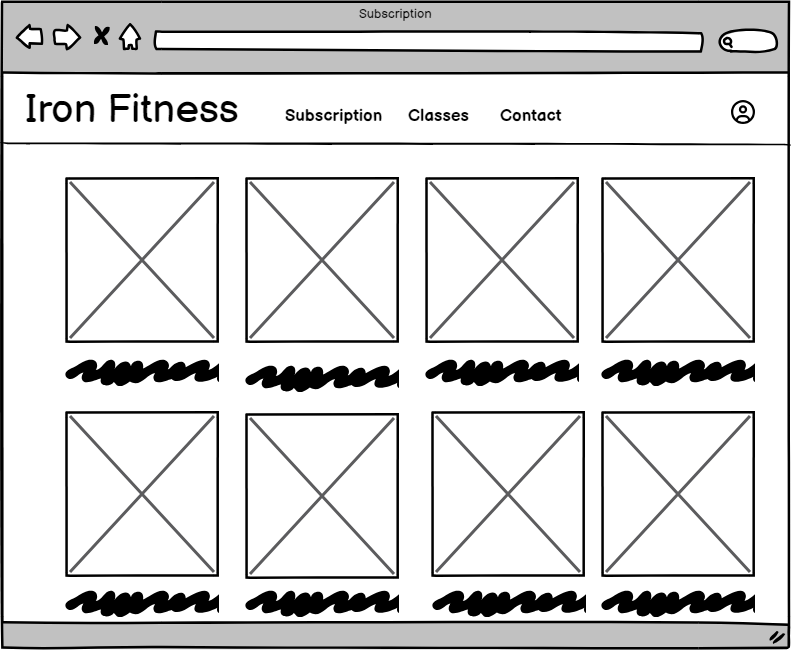

# Iron Fitness

- Iron Fitness Gym is an all encompasing website built to simplify the gym goers experience. 
- It features a complete membership subscription service and and class booking. 
- All done in a sleek, modern and user friendly style

## Design

### Wireframes

#### Desktop

Home

Subscription

Plan Details

Checkout

Checkout Page 2

Successful purchase

Classes

Booking Successful

Contact

Profile

Profile Edit

#### Mobile

Home

Subscription

Plan Details

Checkout

Checkout Page 2

Successful purchase

Classes

Booking Successful

Contact

Profile

Profile Edit

#### Side note
- I didnt make any wireframes for the allauth pages since i didnt really change the layout of them

### Styling

#### Color Pallette
- I wanted a clean looking website so the color pallette i chose was just black and white

#### Font 
- I wanted the font to be modern and sleek so i decided to go with Roboto.

## Site content

### My pages

#### The landing page

 - The landing page gives the user a stylish welcome to the page 
 - It features a short video to grab the attention of the users

  

Click to expand

  

  
  

#### The subscription page

 - The subscription page houses the different subscription plans available on the site

  

Click to expand

  

  
  

 #### The plan details page

 - This page displays infromation about the plan the user selected
 - It also has a subscribe now button which is how you access the checkout page

  

Click to expand

  

  
  

 
 #### The checkout page

  - This is where the user can subscribe to any given plan
  - It features clean form and a stripe payment system which makes it very easy to use for the user

  

Click to expand

  

  

  

  
  

#### The Contact page

 - This page displays the necisary infortmation about the gym, like contact number and mail. It also has a google maps link that displays "the location" of the gym. 
 - It also features an image slider that 

  

Click to expand

  

  

  

### Allauth pages

 - These are the pages that are supplied with allauth, although i have customized them a little.

  ### Profile page

  

  ### Profile edit page

   

  ### Login 

  

Click to expand

  

  

  

  ### Register 

 
  

Click to expand

  

  

  

  ### Change password

  

Click to expand

  

  

  

  ### Forgot password
  

Click to expand

  

  

  

## Features 

### Existing Features

#### Base template
  - This project features a base template which is used to clean up the rest of the code by simply extending it in every other template

#### Navigation Bar
  - Accessible on all pages, the fully responsive navigation bar includes links to the Home page, Classes page, Subscription page, Contact page, and the pages tied to the user profile

Click to expand

#### Stripe payment system

Click to expand

#### Managing subscriptions

Click to expand

#### Binding time

Click to expand

#### Dynamic display of active subscriptions

Click to expand

#### Class booking system 

Click to expand

#### Class scheduling

Click to expand

#### Google maps

Click to expand

#### Allauth features
- The site uses allauth which handles user accounts
- This allows the users to register accounts login, reseting passwords and managing their accounts

#### MailJet 
- MailJet is used to send emails to the user

### Features Left to Implement

- An online shop for supplements, clothing and gym equipment
- Profile picture changer

## Technologies Used

### Packages

The following packages were installed throughout the development. 

| Package Name| Package Description |
| ----------- | ----------- |
| [Django-allAuth](https://docs.allauth.org/en/latest/)
| [Whitenoise](https://pypi.org/project/whitenoise/)   
| [Pillow](https://pypi.org/project/pillow/) 
| [Stripe](https://dashboard.stripe.com/test/developers) 
| [Black](https://pypi.org/project/black/) 

### Tools and Programs Used

- [GitPod](https://gitpod.io/workspaces) was used as the main IDE for the project. 
- [Git](https://git-scm.com/) was used for version control. 
- [GitHub](https://github.com/) for hosting my repository
- [Heroku](https://id.heroku.com/login) was used for deployment.
- [Favicon.io](https://favicon.io/) was used to create the favicon for Perfect Fit.
- [AmIResponsive](https://ui.dev/amiresponsive) for creating the README header image. 
- [FontAwesome](https://fontawesome.com/) for providing icons used throughout the site.  
- [Balsamiq](https://balsamiq.com/) for creating the wireframes. 
- [Code Institute Pep8 Linter](https://pep8ci.herokuapp.com/#) was used for reviewing all .py files during code validation tests. 
- [Google cloud](https://console.cloud.google.com/welcome/new?project=plated-reducer-430217-s6) was used for implementing google maps
- [Canva](https://www.canva.com) was used for creating assets used in the project

## Testing 

### Validator Testing 

- HTML
  - No errors were returned when passing through the official [W3C validator](https://validator.w3.org/nu/?doc=https%3A%2F%2Fcode-institute-org.github.io%2Flove-running-2.0%2Findex.html)
- CSS
  - No errors were found when passing through the official [(Jigsaw) validator](https://jigsaw.w3.org/css-validator/validator?uri=https%3A%2F%2Fvalidator.w3.org%2Fnu%2F%3Fdoc%3Dhttps%253A%252F%252Fcode-institute-org.github.io%252Flove-running-2.0%252Findex.html&profile=css3svg&usermedium=all&warning=1&vextwarning=&lang=en#css)
- Python
 - All of the .py files were formatted using Black and then checked with a Pep8 linter, all of the files passed this check - however the settings.py had long lines for the password authentication section and I was unable to remedy this issue. 

### Lighthouse tool

### Manual testing

#### Navigation
| Feature Tested  | Outcome  | Test Performed  | Result  | Pass/Fail  |
|---|---|---|---|---|
|  Home | Display the home page| Click site logo | Taken to the homepage | Pass  |
|  Subscription | Display the plans page| Click Subscription | Taken to the plans page | Pass  |
|  Classes | Display the Classes page| Click Classes | Taken to the Classes page | Pass  |
|  Contact | Display the Contact page| Click Contact | Taken to the Contact page | Pass  |
|  Profile | Display the Profile page| Click the profile dropdown and then my profile | Taken to the Profile page | Pass  |
|  Profile Edit | Display the Profile Edit page| Click the edit profile button in the profile page | Taken to the Profile Edit page | Pass |

#### Accounts
| Feature Tested  | Outcome  | Test Performed  | Result  | Pass/Fail  |
|---|---|---|---|---|
|  Logout | Logs out the user | Click the logout button in the account dropdown | Gets logged out | Pass |
|  Login | Logs in the user | Click the login button in the account dropdown | Taken to login page then gets logged in after filling it out | Pass |
|  Register | Registers the user | Click the register button in the account dropdown | Taken to register page then gets logged in after filling it out | Pass |
|  Change password | Displays change password page | Click the change password button in the profile page | Taken to the change password page | Pass |
|  Forgot password | Displays forgot password page | On the login page click forgot password | Taken to the forgot password page | Pass |

#### Plans and subscription
| Feature Tested  | Outcome  | Test Performed  | Result  | Pass/Fail  |
|---|---|---|---|---|
|  Show plans | All plans should be shown when on the plans page | View all plans on the plans page | All plans shown  | Pass  |
|  Show plan details  | When clicking on a plan you are taken to the relevant details page | Choose a plan and see if you get taken to the correct page | You get taken to the correct page | Pass  |
|  Subscribe now button  | When clicking on subscribe you should be taken to the checkout page| Clicking the subscribe button | You get taken to the checkout page | Pass |
|  Order overview  | The order overview displays the correct information about the selected plan | Reading the order overview | The information is correct | Pass |
|  Subscribing  | The payment goes through and the user gets a subscription| Filling out order form and clicking pay now | The order goes through and the subscription gets added to the profile | Pass |
|  Cancelling subscription  | The user can cancel a non binded subscription | On profile page click manage subscription and then click cancel | The subscription gets canceled | Pass |
|  Prevent double subscription  | The user cant subscribe again if they already have an active subscription | When subscribed click on a new plan | The subscribe now button is gone | Pass |
|  Binding Time | The user cant unsubscribe if they have a bound subscription | When subscribed to a plan with binding time click manage on the profile page | The cancel button is gone | Pass |

#### Mailjet
| Feature Tested  | Outcome  | Test Performed  | Result  | Pass/Fail  |
|---|---|---|---|---|
|  Send password reset email | The password reset email should be sent when requesting a password change | On the log in page click forgot password and fill out the form | Emial was sent | Pass  |
|  Send email verification mail | An email verification mail should be sent when signing up | Sign up for an account | Email was sent | Pass  |

### Unfixed Bugs

- When signing up it says internal server error but if you refresh the page it works again

## Deployment

For this project the application was deployed to Heroku using the following steps:

1. I logged into my Heroku account and navigated to the dashboard. 
2. From here I clicked 'New' and created a new app.
3. perfect-fit was chosen as the app name and region set to EU, finally I clicked 'Create app'
4. In the 'Settings' tab and from here I located the section 'Config Vars' and clicked 'Reveal Config Vars'
5. Ensure that within the settings.py file the DEBUG has been set to False
6. From here you can add your environment variables for your Database, Secret Key, CollecStatic, Cloudinary Database, Stripe Public Key, Stripe Private Key and Webhook Secret. 
7. After this has been done navigate to the 'Deploy' tab and under 'Deployment Method' click on 'GitHub'.
8. Locate the repository from GitHub and paste the link here and click 'Connect'.
9. Ensure that the selected branch is 'main branch' before clicking to Deploy. 
10. Once the build is finished there should be a message saying 'Your app was successfully deployed' with a 'View' button.

## Credits 

- [Pexels](https://www.pexels.com/sv-se/) for images used on the site
- The Boutique Ado walkthrough project, which helped with the building of my project
- [Codepen] (https://codepen.io/kevinpowell/pen/BavVLra) for helping me with the scrolling message banner
- [Youtube] (https://www.youtube.com/watch?v=PkADl0HubMY) for helping me with the image slider
